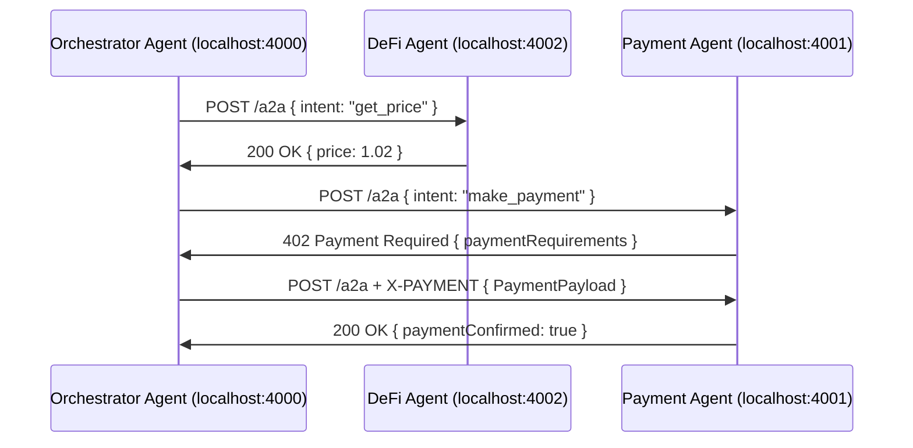

# Universal Agent Communication Protocol (UACP) - Somnia

A comprehensive system architecture for building agent-to-agent communication protocol using Google A2A and X402 payment protocol.

## High-Level System Architecture

┌──────────────────────────────────────────────────────────┐
│                  DASHBOARD / DEV TOOLS                   │
│   Agent registry, logs, orchestrator, agent visualizer    │
└───────────▲───────────────────────────────────────────────┘
                │
  ┌─────────────┴─────────────┐      ┌────────────┐
  │        SDK LAYER          │<---->│  Smart     │
  │ (TypeScript, Pluggable)   │      │ Contracts  │
  └─────────────▲─────────────┘      └────────────┘
                │
┌───────────────┴──────────────┐
│        Application Agents     │
│   (Payment, DeFi, Demo, etc) │
└───────────────▲──────────────┘
                │
        ┌───────┴───────────┐   ┌─────────────────────┐
        │   A2A HTTP API    │<->│     Off-chain bus   │
        │ (Google AgentCard)│   │ (for local routing) │
        └───────────────────┘   └─────────────────────┘
                ││
            [X402 Payments]

## Component Summary

- **Agents (App Layer)**: Written by developers, run locally (Docker, Vercel, etc.), speak A2A & optionally integrate payments using X402
- **UACP SDK**: Standardizes:
  - AgentCard/registration
  - Agent registry discovery
  - Payment hooks via X402
  - Event handling, rate limiting, retries, etc.
- **Smart Contracts (Somnia)**: Used for on-chain registry, optional audit log, and future asset management
- **Dashboard**: Monitor, configure, and register agents. Useful for demo
- **Transport/Bus**: Handles intranet/off-chain message dispatch for fast, cheap delivery
## Directory Structure

**Note**: Standalone folders structure (not monorepo)

uacp-root/
│
├── contracts/             # Somnia contracts (Solidity)
│   ├── AgentRegistry.sol
│   └── UACPEvents.sol
│
├── sdk/                   # TypeScript SDK
│   ├── src/
│   │   ├── index.ts
│   │   ├── agent.ts
│   │   ├── router.ts
│   │   ├── registry.ts
│   │   ├── agentcard.ts
│   │   ├── x402.ts
│   │   ├── a2a.ts
│   │   └── utils/
│   ├── examples/
│   │   ├── payment-agent.ts
│   │   ├── defi-agent.ts
│   │   └── orchestrator-agent.ts
│   ├── tests/
│   ├── package.json
│   └── README.md
│
├── agents/                # Real agent implementations
│   ├── payment/
│   │   └── index.ts
│   ├── defi/
│   │   └── index.ts
│   └── orchestrator/
│       └── index.ts
│
├── dashboard/             # Next.js + shadcn UI demo
│   ├── components/
│   ├── pages/
│   ├── lib/
│   ├── public/
│   └── styles/
│
├── infra/                 # Docker, Vercel, deployment scripts, CI/CD
│   ├── docker-compose.yml
│   ├── vercel.json
│   └── scripts/
│
└── docs/                  # Protocol, API design, integration examples
    ├── protocol.md
    ├── agentcard.md
    ├── sdk.md
    ├── x402.md
    └── diagrams/
```

## SDK Flow

### 1. Agent Bootstrapping

- Developers instantiate a `UACPAgent` in TypeScript, filling out required fields for AgentCard (name, endpoints, capabilities)
- On startup, agent registers with:
  - Local registry (off-chain, quick)
  - On-chain AgentRegistry (if needed, for trust/analytics)

### 2. Discovery

- SDK exposes discovery APIs:
  - `findAgentsByType(type: string): AgentCard[]`
  - `getAgentById(id: string): AgentCard`
- Uses on-chain registry as source of truth for demo

### 3. Messaging (Core)

**A2A Message Flow** (based on Google A2A):

- Each agent exposes an HTTP endpoint (A2A server, e.g., `/a2a`)
- Other agents POST messages to these endpoints:
  - Message includes: sender ID, intent/task, metadata, signed payload if needed
  - Optionally, attach context/group ID for workflows
  - Each message is JSON, with required A2A keys (see protocol)
- Server (Agent) receives, runs handler, responds with status, result, or event stream (SSE for long tasks)

### 4. Payments (X402 Flow)

**If agent response requires payment:**

- HTTP 402 with JSON PaymentRequiredResponse and paymentRequirements (amount, address, asset, scheme, supported networks)
- Client agent parses, creates X402 Payment Payload, includes in `X-PAYMENT` HTTP header for retry
- Resource agent (or facilitator) verifies using X402 `/verify` and `/settle` flow; only delivers data if paid in full
- SDK abstracts all X402 logic

### 5. Extensibility

- Add payment/streaming models
- Modular event system for agent lifecycle, registry changes
- Pluggable transport (future cross-chain, X402+, etc)

### 6. Error Handling & Retry

- SDK auto-translates A2A errors/status codes (429, 5xx, etc)
- Retry policy: configurable (exponential backoff, etc)
- Monitoring hooks for dashboard
## SDK File Structure and Key APIs

### `src/index.ts`
- Entry point; exports primary Agent class, types

### `src/agent.ts`
- `UACPAgent`: bootstraps agent, handles registry, inbound/outbound A2A messages, routes intents, exposes event emitter

### `src/registry.ts`
- Discovery, registry fetch, on-chain registration if needed

### `src/router.ts`
- Outbound/inbound routing, retry, workflow orchestration, channel selection

### `src/a2a.ts`
- Implements Google A2A message formats, helpers, hooks for custom payloads

### `src/agentcard.ts`
- Agent identity/capability/endpoint metadata spec

### `src/x402.ts`
- Encapsulates request/response, verification, and settlement for each paymentRequired scenario

### `src/utils/`
- Utilities: logging, (optional) signing/crypto, error classes

## Message and AgentCard Structure (Schemas)

### AgentCard Example

```json
{
  "id": "did:somnia:payment-agent-001",
  "name": "Payment Agent",
  "description": "Handles payments via X402",
  "endpoint": "https://localhost:4001/a2a",
  "capabilities": ["receive_payment", "settle", "refund"],
  "auth": { "type": "none" },
  "paymentMethods": ["x402"],
  "status": "online"
}
```

### A2A Message Example

```json
{
  "id": "uuid-v4",
  "timestamp": 1728691200,
  "sender": "did:somnia:orchestrator-001",
  "recipient": "did:somnia:payment-agent-001",
  "intent": "make_payment",
  "task": {
    "amount": "100",
    "asset": "USDC",
    "to": "0x123...",
    "paymentProtocol": "x402"
  },
  "context": "workflow-xyz",
  "type": "request",
  "priority": "high",
  "ttl": 60,
  "signature": "0x..."
}
```
## Demo Workflow: Sequence Diagram


## Future-Proofing for Multi-Chain

- Agents default to using A2A + X402 on Somnia
- All schema, registration, messaging flows support chainId, network params for easy extension to Ethereum, Polygon, Base, etc.
- Payment logic isolated—can implement additional flows later
## Integration Flow for Developers Using SDK

### 1. Install SDK
```bash
npm install @uacp/somnia-sdk
```

### 2. Create Agent
```typescript
import { UACPAgent } from '@uacp/somnia-sdk';

const agent = new UACPAgent({
  agentCard: { ... },
  registryUrl: "...",
  agentHandlers: { ... }
});

agent.listen(); // starts A2A HTTP/SSE server
```

### 3. Register Agent
```typescript
await agent.register();
```

### 4. Send Message
```typescript
await agent.sendMessage({ ... });
```

### 5. Handle A2A Payment Required
- SDK automates X402 payment negotiation and response handling

### 6. Monitor with Dashboard
- All event streams/logs exposed via websocket, visualized in NextJS frontend
## Summary of Key Choices

- **Simplicity First**: All agents and SDK API optimized for hack/demo speed, little/no on-chain logic to start
- **Industry Standards**: Adopts Google A2A for multi-agent communication; X402 for agent-native payments
- **Best Practices**: Main registry for agent discovery; SDK handles all protocol compliance, error handling, payment negotiation
